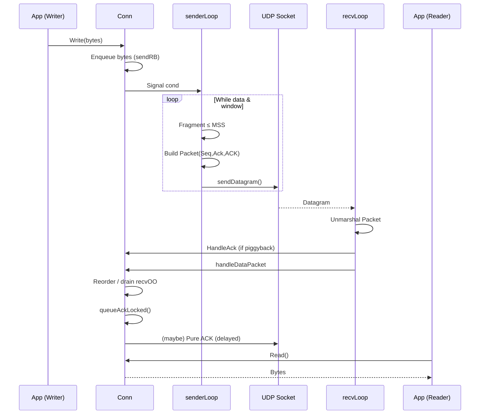

# RUDP (Proof of Concept)

Reliable UDP with minimal mechanisms: fixed-interval retransmissions, cumulative ACKs, simple packet window, basic 3‑way handshake.

## Current Status Summary

Works today:
- 3‑way handshake (SYN → SYN|ACK → ACK) with random non‑zero ISNs.
- Cumulative reliability (no SACK) using single connection-level retransmission timer.
- Fixed RTO (no RTT sampling, no backoff) + global resend of all unacked packets each tick.
- Flow control: sender-side packet count window (`MaxWindowPackets` considered conversion for MaxWindowBytes for better performance), MSS-bounded fragments.
- Fragmentation: simple slice of up to MSS bytes per packet (no coalescing / segmentation logic beyond cap).
- Delayed ACK: single configurable `AckDelay` timer (pure ACK or piggyback on outgoing data).
- Out-of-order receive buffering with gap fill & drain (`recvOO` map).
- Ring buffers: send (bytes) + recv (bytes). Blocking `Write` until space.
- Error surfacing: `ErrChan` (retransmission limit, data loss on close, marshal errors).
- Listener accepts only established connections; server handshake runs per inbound SYN.

Not implemented / not present:
- FIN/close protocol (flags exist; logic is TODO / unused).
- Half-close, TIME-WAIT, RST, keepalive/ping.
- Congestion control, pacing, rate limiting.
- Adaptive RTO (no RTT measurement), exponential backoff, per-packet timers.
- Selective ACK, fast retransmit, loss detection heuristics beyond timeout.
- Use of advertised receive window (`Win` field) by sender (currently ignored).
- MSS/Path MTU discovery (fixed MSS from config only).
- Byte-based dynamic window / BDP autotuning.
- Checksum beyond UDP (no payload integrity apart from lower layer).
- Security (no encryption, authentication, replay protection).
- Stats/metrics/telemetry surfaces.
- Config field `SendBufBytes` (unused; send buffer size derived from window*MSS*2).
- Backpressure signaling aside from blocking `Write`.

Platform assumptions: standard Go net.UDP; loopback benchmark only; no OS autotuning hooks.

## Architecture Overview

Data path (outbound):
Application → `Conn.Write` → send ring buffer → `senderLoop` → fragment (≤ MSS) → packet build (Seq/Ack/Flags) → UDP send → network.

Receive path: UDP recv → `recvLoop` → parse → (handshake vs established) → data: ACK handling + reordering + ring write → `Conn.Read` → Application.

ACK path: receiver marks `ackPending`; delayed (timer) or immediate; pure ACK or piggyback in data packet (`FlagACK`).

Mermaid sequence (simplified steady-state):


## Reliability Mechanisms (Existing)
- ACKs: Cumulative only. Data packets always carry `Ack`. Pure ACK packets (`FlagACK`, `Len=0`) sent on delay timer or immediately (duplicates, out-of-order, buffer full).
- Retransmission: Single fixed-interval connection-level timer; every tick retransmits ALL unacked packets (handshake + data). No RTT measurement, no per-packet timers, no exponential backoff. Limit enforced by `RetransmissionLimit` per packet; exceeding closes connection and emits error.
- Window: Sender-side count of in-flight packets (`len(unacked) < MaxWindowPackets`). Receiver advertised `Win` (bytes) set only on pure ACK; unused by sender.
- Reordering: Out-of-order packets stored in `recvOO` keyed by starting `Seq`; drained when gap closes. No explicit cap beyond recv buffer space.
- Fragmentation / MSS: Each packet contains up to `MaxSegmentSize` bytes; no multi-packet segmentation logic aside from slicing to MSS.
- Checksum/validation: Only length/header sanity checks; no additional checksum.
- Pacing / rate limiting: Not implemented.
- Close semantics: `Close()` does NOT send FIN; it halts timers, signals waiters, may emit `ErrDataLost` if unsent or unacked data remained; no half-close.

## Configuration & Defaults
(From `config.go` after `Normalize()`)
- `MaxSegmentSize` (MSS): `DefaultMSS` (1200 - 13 = 1187 bytes payload).
- `MaxWindowPackets`: 1024.
- `RetransmissionInterval` (RTO fixed): 200ms.
- `MaxRetransmissionInterval`: 4s (NOT USED currently).
- `RetransmissionLimit`: 8 (per packet, including handshake packets).
- `AckDelay`: 5ms (0 => immediate ACK).
- `RecvBufBytes`: 16 MiB.
- `SendBufBytes`: 16 MiB (NOT USED; actual send buffer = window*MSS*2).

## Wire Format (As Implemented)
Header (13 bytes):
- `Seq` (4): first byte sequence number of this segment.
- `Ack` (4): cumulative ACK (all bytes < Ack received).
- `Flags` (1): bitmask (SYN=1, ACK=2, FIN=4).
- `Win` (2): advertised free receive window in BYTES (only set on pure ACK; 0 on data packets currently).
- `Len` (2): payload length.
- `Payload` (Len bytes).

Usage:
- Data: `Len>0`, always sets `FlagACK`, `Win`=0.
- Pure ACK: `Len=0`, `FlagACK`, sets `Win` to clamped free bytes (≤ 0xFFFF).
- Handshake: SYN (no payload), SYN|ACK, final ACK.
- FIN: Flag defined but not produced/consumed.

## State & Timers (As Implemented)
States defined: `Closed, Listen, SynSent, SynReceived, Established, FinSent, FinReceived, TimeWait`.
Active transitions exercised: Closed → SynSent → Established (client); Closed → SynReceived → Established (server). FIN-related states unused.
Timers:
- Retransmission timer: single `time.AfterFunc` repeating at fixed `RetransmissionInterval` while any unacked packets exist.
- Delayed ACK timer: per-connection `ackTimer` (fires once per pending ACK batch) with delay `AckDelay`.
Cancellation:
- Retransmission timer stopped when `unacked` empty or connection closed.
- ACK timer canceled (stop) on close or when ACK sent.
No other timers (no keepalive, no linger/TIME-WAIT).

## Buffers & Memory
- Send ring: size = `MaxWindowPackets * MaxSegmentSize * 2` bytes; holds queued outbound data not yet packetized. Bytes removed upon packetization (not upon ACK); retransmissions use stored packet copies in `unacked` map.
- Receive ring: size = `RecvBufBytes`; holds in-order assembled payload bytes for `Read`.
- Out-of-order map: one entry per future gap start (key = packet.Seq). Evicted on drainage.
- Packet copies: each in-flight packet (data + handshake) retained until cumulatively ACKed; payload slice owned exclusively by `unacked` entry.
- Zero-copy: Not present (copies on UDP read into new slice, into recv ring, then into caller buffer on `Read`).
- GC considerations: One allocation per outbound packet payload; per in-order + out-of-order inbound packet payload; ring buffers reuse internal slabs.

## Benchmarks & Expected Localhost Behavior
Benchmark: `BenchmarkRUDPTransfer10MiB` (one 10 MiB unidirectional transfer client→server; handshake excluded from timed portion).
Running:
```bash
go test -run ^$ -bench BenchmarkRUDPTransfer10MiB -benchtime=1x ./mod/udp/rudp
RUDP_BENCH_PROGRESS=1 go test -run ^$ -bench BenchmarkRUDPTransfer10MiB -benchtime=1x ./mod/udp/rudp
```
Reports:
- MiB/s throughput (write phase only).
- Allocations, bytes per op.
Typical throughput: Not documented in code (dependent on fixed window * MSS / RTO / ACK delay and host performance).

## Missing Pieces
- No FIN exchange / graceful close / half-close.
- No congestion control or pacing.
- No RTT measurement / adaptive RTO / backoff (fixed interval only).
- `MaxRetransmissionInterval` unused.
- No selective ACK (SACK) / fast retransmit / loss detection beyond timeout.
- No use of advertised `Win` (flow control purely packet-count based).
- No path MTU discovery / dynamic MSS.
- No checksum beyond UDP; silent data corruption undetected at transport layer.
- No encryption / authentication.
- No keepalive / idle timeout / ping.
- No connection IDs beyond initial Seq reuse; no NAT rebinding handling beyond IP match.
- `SendBufBytes` config unused.
- Backpressure only via blocking writes; no error signaling before block.
- 
## Future Improvements
### Near-term Safety & Performance
- Adaptive byte-based window & BDP autotune.
- RTT sampling + RFC 6298 RTO calculation + exponential backoff.
- Packet pacing / rate shaping.
- Time-threshold (fast) loss detection + limited fast retransmit.
- Adaptive ACK delay (heuristics based on flight / reordering).

### Protocol Completeness
- Proper FIN handshake, half-close, and TIME-WAIT handling.
- Explicit connection IDs distinct from ISNs.
- RST/abort semantics.
- Keepalive / ping frames.

### Robustness & Reliability
- Path MTU discovery (PLPMTUD) + MSS adjustment.
- Selective ACK (SACK) & out-of-order range tracking.
- Reordering window limits / discard policies.
- Detailed stats / telemetry (RTT, loss, retransmits, goodput).
- Error surfaces for flow control violations / protocol anomalies.

### Tooling & Testing
- Loss / delay / duplication chaos test harness.
- Cross-platform CI with network emulation.
- Long-running soak / stress tests (memory & stability).
- Benchmark variants (bidirectional, varying window/MSS).

## Benchmarks (uTP Comparison)

| Implementation | Iterations | ns/op (mean) | Throughput (MB/s) | B/op        | allocs/op |
|---|---:|---:|---:|---:|---:|
| **rudp** (`github.com/cryptopunkscc/astrald/mod/udp/rudp`) | 48 | 71,213,610 | 147.24 | 23,393,100 | 94,552 |
| **uTP** (`github.com/anacrolix/utp`)                       | 48 | 24,602,392 | 426.21 | 82,243,573 | 93,825 |

### Notes

Numbers come from the respective benchmark outputs on loopback (localhost), 10 MiB payload; handshake/setup excluded from the timed region.

uTP shows ~3× higher throughput on this workload. Allocation counts are comparable; rudp allocates fewer bytes/op but runs slower overall.

This rudp is a proof of concept and has not been profiler-guided or optimized yet.

### Potential Improvements to Close the Gap

Adding fast retransmits / time-threshold loss detection and switching from a packet-count window (MaxWindowPackets) to a byte-based window (MaxWindowBytes) with BDP-aware autotuning will most likely bring performance closer to uTP on high-throughput paths.

Additional expected wins: adaptive ACK delay (immediate on reordering/gap), pacing, and better RTO sizing